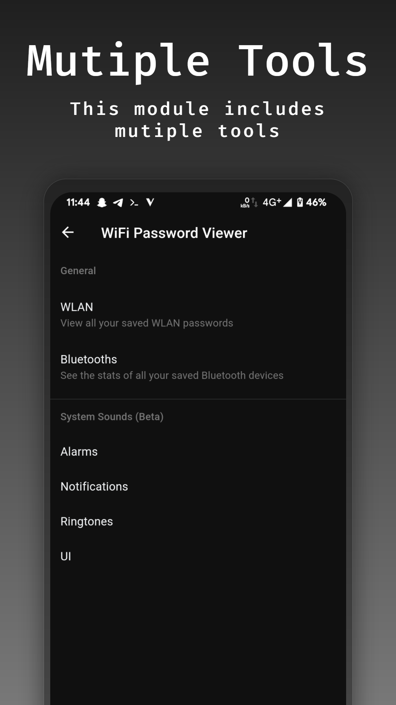
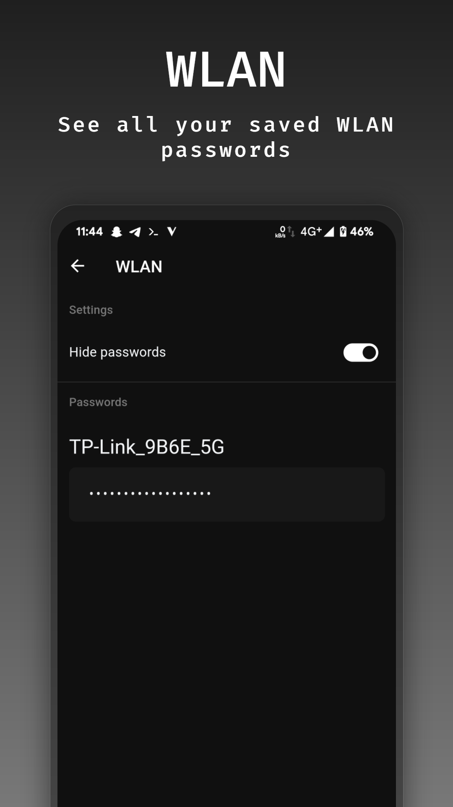
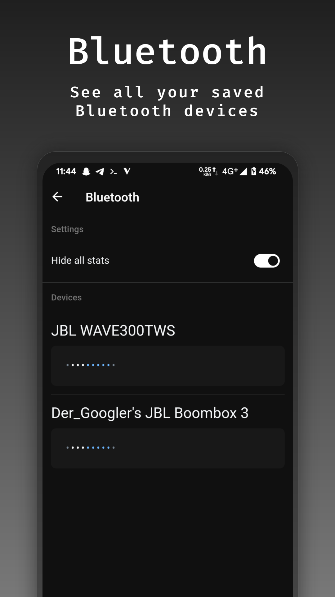
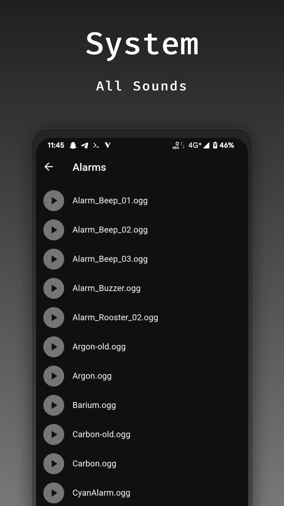
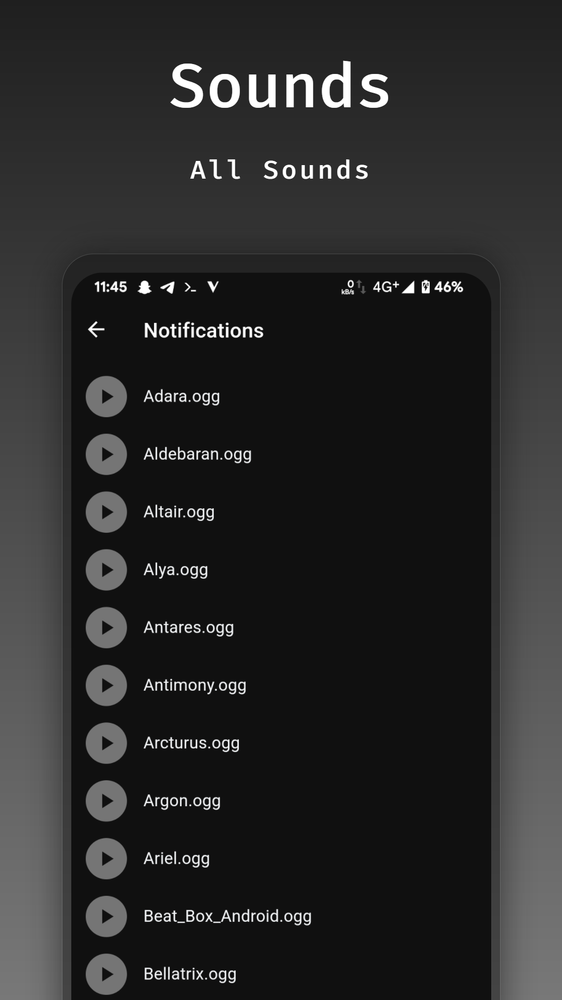

# WiFi Password Viewer for MMRL

An inspired project from [veez21](https://github.com/veez21)'s [wpd gist](https://gist.github.com/veez21/4f2541d271809864411e3ffbbe8e3df9), ported to MMRL.
This project is also a example to show how powerful MMRL's ModConf feature is.

> This module does not extract passwords from unauthorized wifi's. This module is for education purpose only

## Screenshots

  
  
  
  
  

## TODO

- [ ] Build full functional library 

## Notes

- Dex files should have the permission `444` to avoid conflicts on Android 14
- Chars with in this regex (`[^a-zA-Z0-9._]`) will be replaced with `_`